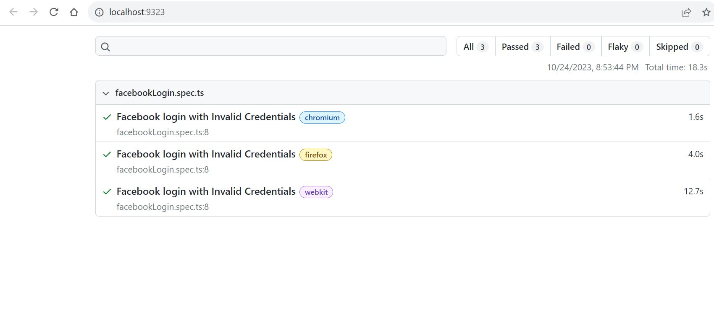

# Playwright_PageObject_Framework
Page Object Model using Playwright Framework for Facebook Login Page

# Introduction:
In the directory where the Playwright framework has been implemented using the Page Object Model for the Facebook login page, a structured and organized approach to web automation testing has been adopted. The Page Object Model (POM) design pattern is used to enhance maintainability and reusability of test code by encapsulating the page elements and their related actions into separate classes.

# Directory Structure <br/>
├── page-object-model <br/>
│   ├── facebook_loginpage.ts <br/>
├── tests<br/>
│   ├── facebookLogin.spec.ts<br/>
├── playwright-report<br/>
│   ├── index.html<br/>
└── package.json<br/>

<li><b>facebook_loginpage.ts</b></li> This file defines the Page Object class for the Facebook login page and holds the locators (selectors) for the page elements on the Facebook login page, making it easier to manage and update them. It includes methods for interacting with elements on the login page, such as entering credentials and clicking the login button.

<li><b>facebookLogin.spec.ts</b></li>
A test script that utilizes the FacebookLogin Page Object class to perform login actions.

<li><b>package.json</b></li> A file that defines project dependencies and scripts. It can include Playwright and any other required packages.


# Run test:
```
npx playwright test
```
It will run test in headless mode.

# Test Report
Test reports can be view using command:
``` 
npx playwright show-report 
```
Reports can be viewed in your default browser on http://localhost:9323/




